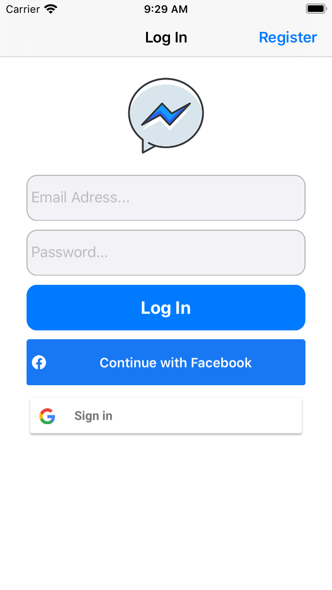
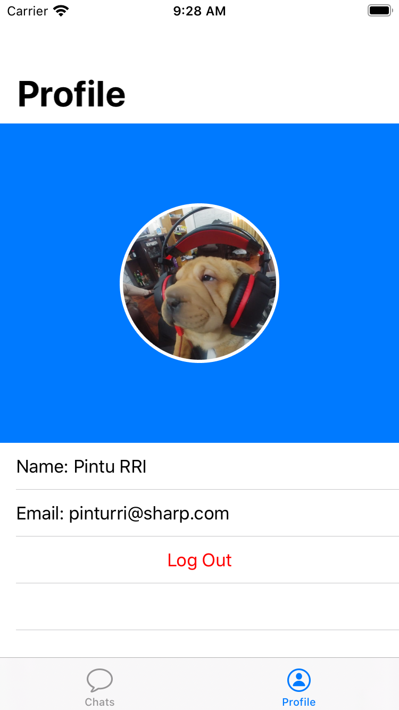
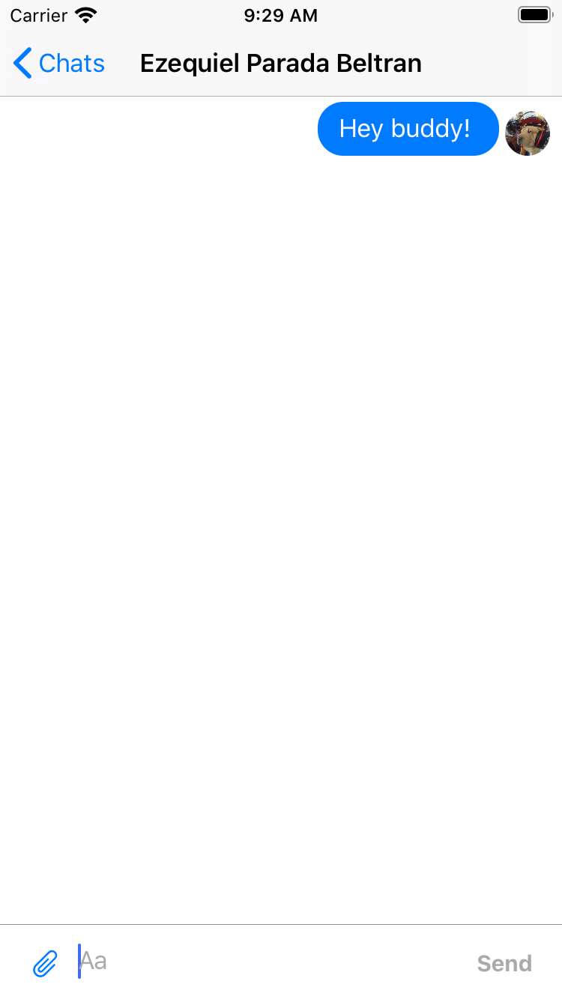
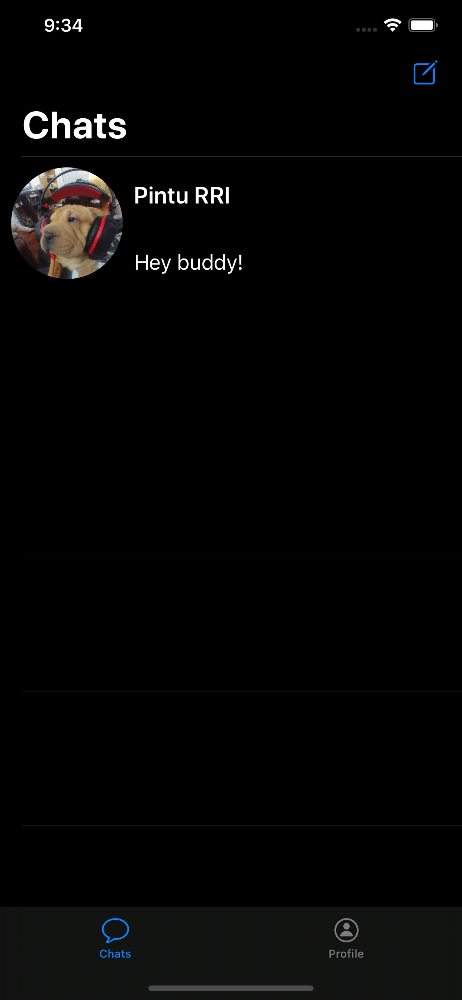
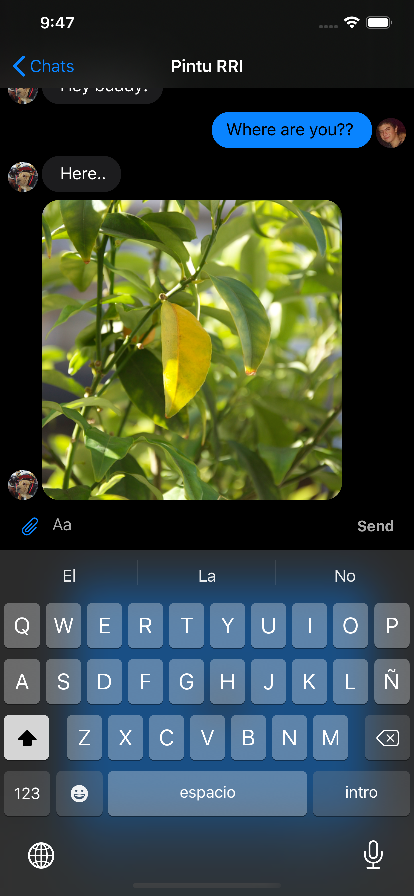
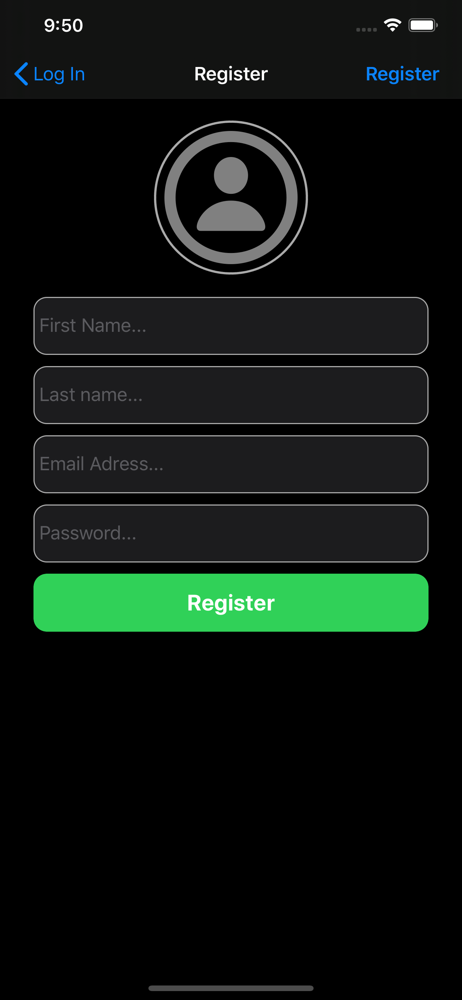

# Messenger Real Time Chat App

A swift project to create a real time chat application in Swift 5 using Firebase.

## Features
- Facebook Log In
- Google Sign In
- Email/Pass Registration / Log In
- Photo Messeges
- Video Messeges
- Real Time Conversations
- Location Messages
- Search for Users
- Deleting Conversations
- User Profile
- Dark Mode Support
## Screenshots

***************

***************

***************

***************

***************

***************
